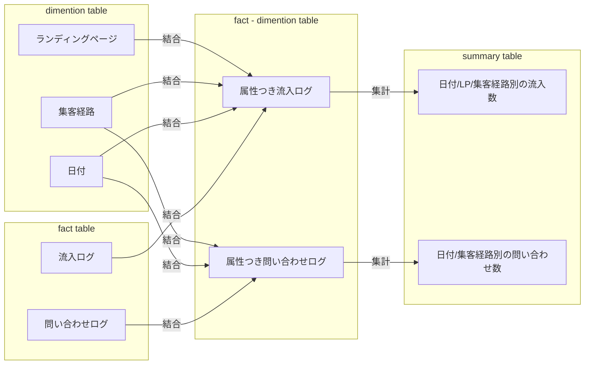
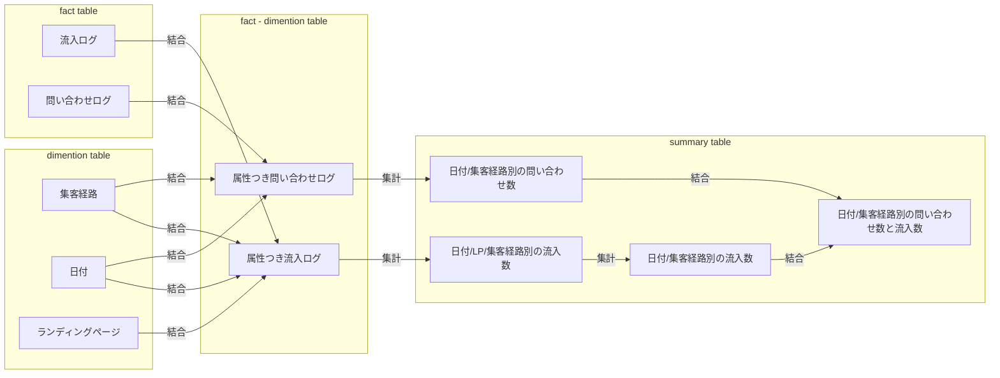
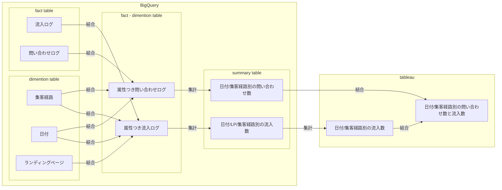
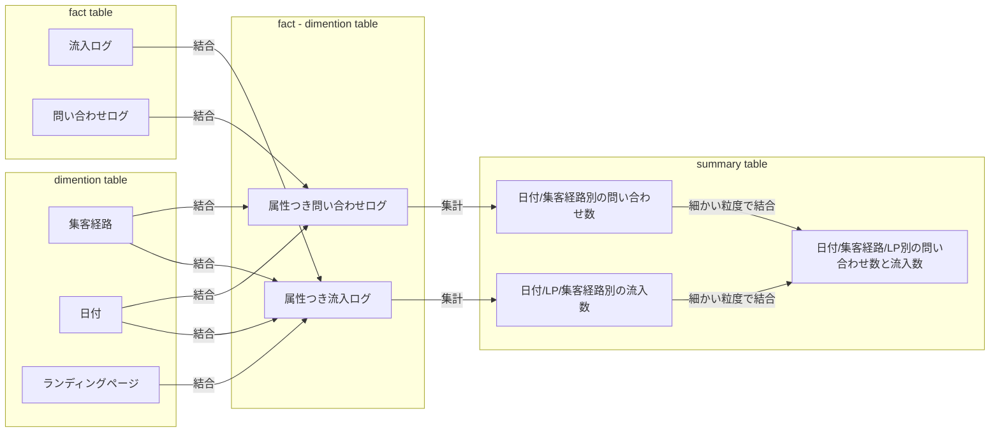

## 経緯:分析したいデータに、ファクトテーブルが複数含まれる。
マーケティングの効果を分析する場合、日付やチャネルなどの軸で、「流入数」と「問い合わせ数」を比較しながら分析したい、ということは多い。
流入と問い合わせはイベント粒度が異なるため、ファクトテーブルも異なる。
よって、スタースキーマも複数存在するため、流入と問い合わせは別々の集計を行い、サマリーテーブルは別で作ることになる。

## 課題: サマリーテーブルが増える
粒度の異なるイベントを同時に分析する場合、集計軸を合わせたサマリーテーブルを用意し、サマリーテーブル同士を結合する必要がある。  
結合するためには、最も粒度の大きなサマリーテーブルに合わせて、細かい粒度のサマリーテーブルは再集計する必要が出てくる。

サマリーテーブル同士の粒度がある程度共通していれば、テーブルがそこまで増えないが、
UU数などは日別の積算が月別の値と合致しない(ユニークカウントする)ため、粒度が共通することの方が稀だったりする。
## 解決案0.サマリーテーブルが乱立したとて別に良い。
サマリーテーブルの命名などで用途を明確にして、数は多いが見つけやすくしておく。
サマリーテーブルは常にviewで作成し、細かい変更ならサマリーテーブルを回収して対応できるようにする。
メリット
    - シンプル
デメリット
    - 規則をちゃんと守らなかった場合、無駄なサマリテーブルが乱立する。
## 解決案1. マルチファクトのサマリーテーブルはデータマートには作らず、BIツールで結合する。
Tableau などのツールでも join できるので、サマリーテーブル同士の結合はBIで実施する案。
BQ上のテーブルが乱立することは避けられるかも知れない。

メリット
- BQのサマリーテーブルが少なくなるので、どれが何のためのテーブルなのかがわかりやすくなる。
デメリット
- マルチファクトのサマリーテーブルを再利用できないので。似た分析要件がある時は都度Tableauで結合させる必要がある。
    - ただし、サマリーテーブルに多用途性を求めること自体が難しいと思う…。
- Tableau で 集計と結合を行うため、処理の負荷が大きい。
    - ただし、既に集計されたテーブルなので、結合の量は大きすぎることはないと期待
## 解決案2. Unified Star Schema を作る
https://towardsdatascience.com/the-new-unified-star-schema-paradigm-in-analytics-data-modeling-review-a245b2641dc8
理解が追いつかなかった。あとでよく考える。
## 解決策3. 粒度の細かいマルチファクトのサマリーテーブルを作る。
BigQuery は Array型を使って、サマリーテーブルを強引に一つにまとめてしまう。利用する時は、利用者が unnest して使う。
### テーブルのイメージ
|行番号|date|集客経路|流入.LP|流入.流入数|問い合わせ数|
|-|-|-|-|-|-|
|1|2021-05-13|google|hoge|100|1|
||||fuga|100||
||||haga|100||
|2|2021-05-13|facebook|hoge|110|2|
||||fuga|130||
||||haga|120||
### パイプライン

メリット
    - 最終的なサマリーテーブルはいつも一つ！
デメリット
    - 利用する場合は常に unnest する必要がある。