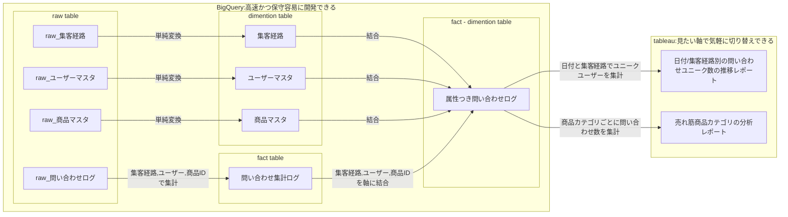
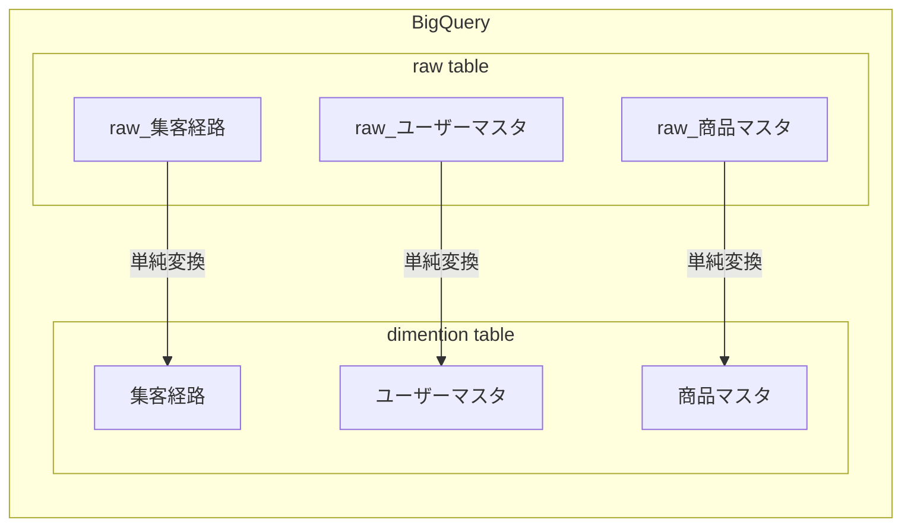
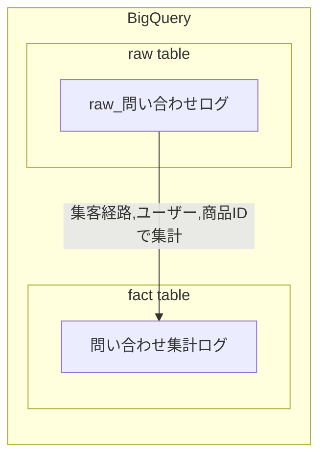
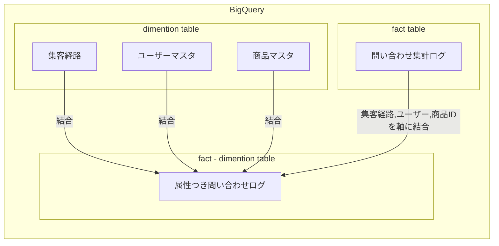
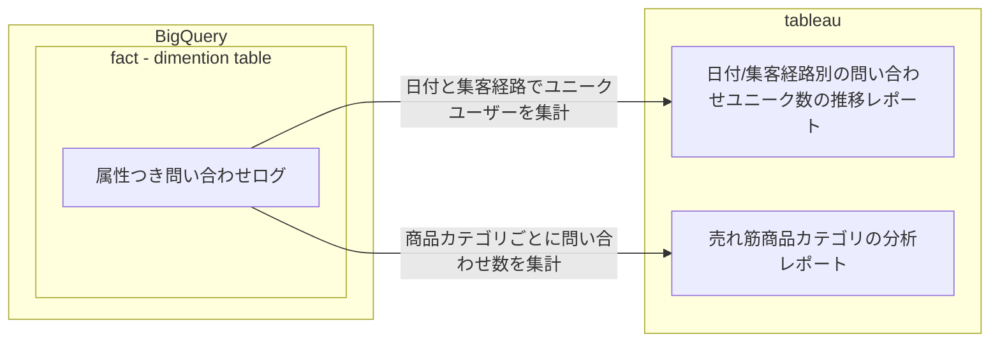

# 結合までをマート側、クロス集計以降をBI側で実行する
計算リソースの必要なjoin系の処理をマート側で実施し、分析要件に応じて変わりやすいクロス集計をBIツール側で実施するのが良いと思っています。
分担のイメージは以下のようになります。

|            役割               | DWH | BIツール |
|-------------------------------|---|---|
| カラム名の変更/単純変換/数値の計算 | ○ | - |
| 特定の軸による集計               | ○ | - |
| 集計軸同士によるテーブルの結合     | ○ | - |
| 複数の属性によるクロス集計        | - | ○ |
| 可視化                         | - | ○ |

# 課題と対策
この分担を考えるモチベーションは主に二つあると考えています。
一つは性能で、昨今のBIツールはとても高機能ですが、結合等の処理を多用したレポートを作ると、どうしても重たいレポートになりやすいです。
もう一つは改修のしやすさで、BIツールは手軽に変更できる一方、コード管理できず作り込みが属人化しやすいという課題もあります。これをSQLで対処してデータマートを作る手もありますが、SQL自体はテストが難しく、実装にも工数がかかってしまいます。
この２つの観点に対して、以下のような方針で考えていきます。
## 性能

読み込みで待たされるのが好きな人はいないでしょう。BIツールは可能な限りヌルヌル動くことを目指します。
以下の方針によって、可能な限り性能を引き出します。

- BIツールはデータの結合を行うと性能劣化することが多いため、可能な限り実施しません。一方で、集計SUMなどの集計処理は比較的早いため、積極的に利用します。
- リソースを消費する結合処理は BigQuery などの計算リソースを使って実施します。あらかじめ必要な情報は全て結合した状態で、DWHに記録しておきます。
## 改修のしやすさ
BI開発は、数ヶ月程度で新しく作り直すことが多いです。これは、データ分析自体が仮設と検証の繰り返しなので、検証が終わると次の分析に必要なレポートが必要になるためです。
仮説検証のサイクルに合わせてレポートを作り直す必要があるのですが、その度にSQLを書いてデータパイプラインを書いて…というのでは待ちくたびれてしまうでしょう。
以下の方針によって、短期間での改修を可能にします。

- tableau の処理は、複雑に作り込むと改修が難しくなります。表計算フィールドから別の表計算フィールドを参照させるようなものや、中間テーブルを作るLOD計算を多用するのは避けます。一方で、分析軸を切り替えたり、SUMをAVGに切り替えるような変更は非常に平易に行えるため、クロス集計の処理は積極的にtableauで行います。
- SQL はテストが難しく、高品質なクエリを作るにはどうしても時間がかかってしまいます。そこで、SQLで作成するテーブルは可能な限り減らし、様々な要望にも答えられる少数のテーブルを用意します。
# 役割の分担

上記を踏まえると、役割分担は以下のイメージが無難だと思います。
(当然、案件に応じてアレンジする必要があります)

|            役割               | DWH | BIツール |
|-------------------------------|---|---|
| カラム名の変更/単純変換/数値の計算 | ○ | - |
| 特定の軸による集計               | ○ | - |
| 集計軸同士によるテーブルの結合     | ○ | - |
| 複数の属性によるクロス集計        | - | ○ |
| 可視化                         | - | ○ |

ポイントは、DWHで集計しすぎないことです。特定の案件に特化したサマリーテーブルを作ってしまうと、転用が効かず、数ヶ月で使われなくなってしまうことが多いです。
適度な粒度の集計にとどめておき、また別の分析をしたくなった場合でも、同じテーブルを再利用することでレポートが作成できるようにします。
これらの各パートごとに、適度な粒度とは何か？DWHでどこまで集計しておくのか？といった疑問に答えつつ、以下に詳細を記載しています。

## 分担詳細

例として、下記のデータパイプラインを元にします。

### カラム名の変更/単純変換/数値の計算
`raw_table --> dimention_table` に該当する部分です。

分析の要件は、商品カテゴリ毎だったり、ユーザー種別ごとだったり、様々です。今回作る分析用のデータマートは。それらの情報をまとめて１つのテーブルから分析できるようにしたいと思います。
しかし、それらの raw_table 自体は文字列型の日付値が入っているなど、性能劣化を引き起こす原因もあるため、事前に変換しておきます。図中では BigQuery で実施していますが、tableau の抽出機能を使って変換しても良いと思います。
こうして揃えた分析用のマスタテーブルを、非公式に dimention table と呼ぶこととします。
### 特定の軸による集計
`fact_table --> fact-dimention table` に該当する部分です。

集計の基本単位となる粒度の軸に揃えます。これが今回のデータマートの `粒度` となります。ECサイトであれば、コンバージョンログとして、商品、ユーザー、コンバージョン時刻で一意となるようなログをイメージしてください。
商品を購入する前に見た集客方法(=広告)が異なる場合、別の成果として計上したい場合もあると思います。その場合は、商品、ユーザー、集客経路、コンバージョン時刻で一意とする場合もあると思います。このような、分析の最小粒度となる情報を、非公式に fact table と呼ぶことにします。この fact table が `適切な粒度` です。
データ量が多くなりやすいため、こちらも BigQuery 等のDWHで実行します。

### 集計軸同士によるテーブルの結合
`属性つき問い合わせログ` を作成する部分です。

データの粒度を揃えることができたら、fact table に、分析軸として使いたい属性を dimention table から付与していきます。
一つの fact table に対して、大量のマスタテーブルを left outer join するため、相当な計算リソースを必要とします。
とはいえ、数100万行程度のオーダーであれば、DWH 製品なら10分程度で処理してくれるでしょう。(従量課金の環境を利用している方は、事前にスキャン量を確認してください)
分析したい粒度のデータに、様々な分析用の属性を持たせたテーブルを、非公式 に fact dimention table と呼ぶことにします。

### 複数の属性によるクロス集計
上記のように上図の `日付と集客経路でユニークユーザーを集計` `商品カテゴリごとに問い合わせ数を集計` に該当する部分です。

単一テーブルで、様々な属性を持つデータマートが作れたら、それをBIツールでクロス集計します。
BIツールは、単一テーブルへの集計処理は比較的早く、数十万行のデータであっても比較的早く(1~3秒)クロス集計を終わらせてくれます。
より素早い速度を求める場合は、直近半年のデータに絞ったり、不要なフィールドを落とした状態でデータを抽出してから、クロス集計を行うといった工夫も可能です。
tableau を利用している場合は、抽出フィルターを使うことでこれを実現できます。

また、クロス集計でみたい観点は頻繁に変わります。例えば、地域別の売り上げを分析し、仮に関西の平均売上が他地方に劣っていた場合は、次に関西圏の都道府県別で売り上げ平均を見たくなると思います。
もし集計テーブルを作ってしまっていたら、group by の条件を地域から都道府県に書き換えて別のテーブルを作る必要があり、これは待っていられません。BIツールであれば容易に変更できる上、ソースとなるテーブルも同じものを使いまわすことができ、工数・品質ともに優れています。
(データが1億行オーダーなど、BIツールによる集計が難しい場合は、例えば週ごと、月ごとなど、分析粒度を見直すのが良いでしょう。)

### 可視化
最後に、線・棒グラフにしたり、傾向線を引いたりといったことは BI ツール側で行います。
特に、7日間移動平均、コホート図、フォールアウト図、といった統計処理はBIツールで簡単に実施できることが多いです。
これらの処理を SQL や python で再現するケースが多いのですが、実装にはそれなりのSQL経験も必要ですし、テスト工数も必要になるため、まずはお手持ちのBIツールでできないか調べてみていただくのが良いと思います。

# まとめ
- Transform 層の各工程のうち、負荷のかかる結合処理までをデータマート側で行うことで、BIツールの性能を維持します。
- クロス集計処理をBIツールで行うことで、集計軸の切り替えを容易にし、単一のデータマートを使いまわせるため、マートの乱立を抑えます。
