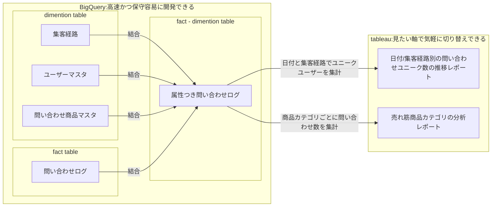

## 結合までがマート側、集計以降はBI側を原則にする
重複などのバグを埋め込みやすく、計算リソースも必要なjoin系の処理をマート側で実施し、
ユニーク集計など条件に応じて演算結果の変わりやすい処理はBI側で手軽に実施する。

## 課題
### BI処理でなんでもやるとどうなるか
Tableau などのツールはなんでもできるが、ブレンディング等を多用すると性能も劣化しやすく、またコード管理が難しいため保守できなくなる。

### マート処理でなんでもやるとどうなるか
1レポートにつき1データマートのようなルールで作ると、クエリ・データマートが乱立し、集計ミスを誘発しやすい
簡単なレポートでもSQLを作成してコミットする必要があり、分析に求めるスピード感とすり合ってない。
半日で作って欲しいと言われる
SQLはテストが難しく、他の言語のようにCI/CDを駆使した生産性向上が難しい。

## 解決策
### 着眼点
ほどほどを狙う。
現在のBI製品(Tableau, Dataportal, Looker, etc...)は結合が不得手。
*そのために data prep とかはあるよ
集計(SUM,AVG,MEAN)などの集計処理は数100万件オーダーの行数でもそれなりに高性能。

昨今のDWH製品(BigQuery)は、フィールド・件数の多いデータを格納し続けてもリソース消費が小さい。
なので集計前の全生ログに、必要な属性を全て結合しておいて、データマートにしておく。

### 実装例

ECサイトを例に考える。
ユーザーによる商品問い合わせを集計する場合は、問い合わせログにあらかじめ属性を結合して、BigQueryにデータマートを作っておく。  
集計は BigQuery では行わず、 Tableau で実施する。

データマートの作成処理は、Argo Workflow や Cloud Composer などを使っても良いし、tableau data prep などを用いても良い。 
ただし、クエリ実行時の計算リソースがBIエンジン側で行われるものは性能劣化を招きやすいため、BigQuery のリソースを使えるものを選ぶと良い。

### 効能
BI側
BIツールの処理がシンプルになるので、メンテしやすい
結合処理を行わないので、早い

データマート側
作成したデータマートの用途限定されないので、複数の分析に流用でき、クエリやテーブルの乱立を抑えられる。
クエリが結合のみになるので、レビューしやすい

### もっと良くなるポイント
メタデータを充足し、属性つき問い合わせログ」ユーザー向けに公開すれば、ユーザーは目的に合わせて集計する。
簡単な分析ならセルフで実施できるようになる。

### まとめ
- 負荷のかかる結合処理をデータマート側で行うことで、BIツールでの性能低下を極力抑えた
- 集計を行う前のテーブルをデータマートとして残しておくことで、データマートの用途を広げ、マートの乱立を抑えた
