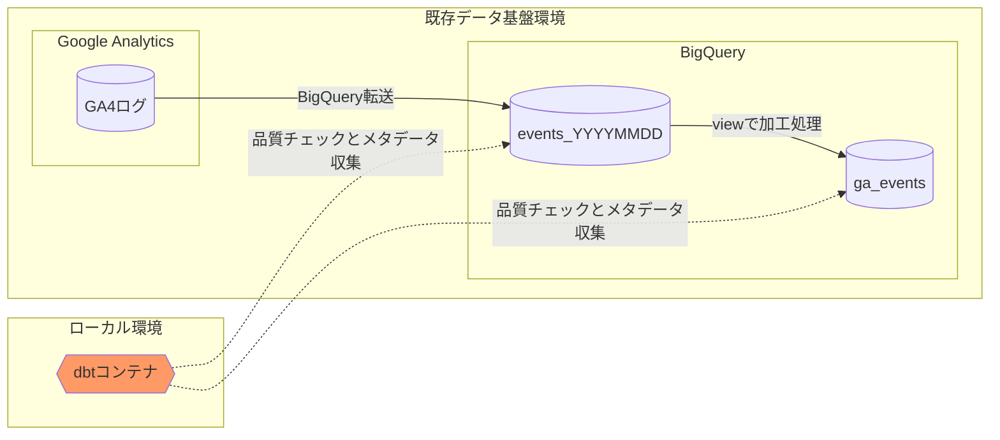

# サマリ
データ基盤の運用に便利な dbt ですが、既存のSQLを拡張SQL記法で書き換えるのが難しく、移行できずにいるチームも多いと思います。そこで、テスト機能とメタデータ管理機能のみを、既存データ基盤に手を加えることなく、導入する方法を解説します。
*dbt cloud ではなく、OSS 版の dbt を利用します。

本記事では、データ基盤の運用課題に有効な手段の一つである dbt を紹介しつつ、実際にBigQuery 上のデータ基盤に導入する方法をデモします。既存の基盤に手を加えずに、以下に示すようなテーブルに対する自動テストや、メタデータを統一して公開するwebサービスを立ち上げることができます。

*テスト実行結果のイメージ*

```
Found 4 models, 2 tests, 0 snapshots, 0 analyses, 156 macros, 0 operations, 0 seed files, 0 sources, 0 exposures

03:10:20 | Concurrency: 1 threads (target='dev')
03:10:20 | 
03:10:20 | 1 of 2 START test not_null_events_*_event_date....................... [RUN]
03:10:22 | 1 of 2 PASS not_null_events_*_event_date............................. [PASS in 1.68s]
03:10:22 | 2 of 2 START test not_null_ga_events_user_pseudo_id.................. [RUN]
03:10:24 | 2 of 2 PASS not_null_ga_events_user_pseudo_id........................ [PASS in 2.37s]
03:10:24 | 
03:10:24 | Finished running 2 tests in 4.85s.

Completed successfully

Done. PASS=2 WARN=0 ERROR=0 SKIP=0 TOTAL=2
```

*メタデータ閲覧サービスのイメージ*


# データ基盤の運用課題と対応指針
データ基盤を運用している方は、以下のような課題に悩んだことがあると思います。

- データマートの集計処理がしばらく失敗していたが、それに気が付けず、ユーザーからのクレームで発覚した。
- テーブルやカラムの説明が無いため、使って良いデータなのかわからない
- リリース後のユーザー数が増えていたが、実はリリースに伴ってデータが重複しており、数値をかさ増しして集計していた

企業のデータ活用が盛んになって久しい昨今では、上記のような課題と対策は整理されつつあります。有名なものとしてDMBOKがあるので、その一部をご紹介します[^note_2]。
[^note_2]: 具体的な打ち手については、筆者の理解を元に記載しています。

|項目|具体的な打ち手|
|-|-|
|データアーキテクチャ|どんなデータが、どんな業務で使われているのかをわかるようにする。例えば、データがどこからやってきてどこで使われているのかを図示しておく。|
|データ統合と相互運用性(ETL)|決まったタイミングでデータを更新・提供する。データ連係に失敗したらアラートを出して、アクションを取れるようにする|
|データモデリングとデザイン|テーブル同士の参照や包含などの情報をメタデータとして記録する|
|データセキュリティ|セキュリティレベルを定義して、メタデータとして記録する|
|データ品質|高品質なデータを定義して、品質を常にチェック・モニタリングする|
|メタデータ管理|様々なデータのメタデータは一箇所に集める。その上で、標準的なアクセス方法を提供し、メタデータの品質と鮮度を保つ|

打ち手自体は手動・自動を問わず実施できますが、現実的には自動化する仕組みが必要なものもあります。例えば、データの品質チェックは、毎日テーブルが更新されるたびに目検でチェックするのは不可能なので、何らかのシステムが必要です。

このようなシステムとして代表的なのが dbt です。

# dbt を使ったデータ基盤の運用
dbt は非常に高機能で、DMBOKにある観点のほとんどの対策を実現できます。下表にDMBOKの項目と、dbtが対応する機能を記載します。

|dbt の提供する機能例|オプトイン可否|
|-|-|
| **データアーキテクチャ:** データパイプライン図を自動生成してくれます。|-|
| **データ統合と相互運用性(ETL):** dbt独自の言語でETLを定義すると、指定したワークフローで実行してくれます。ワークフローに失敗した場合は slack 等への通知が可能です。|-|
| **データモデリングとデザイン:** テーブル、カラムに対して、リレーションや制約を定義し、定義した内容を満たしているかチェックできます。|○|
| **データセキュリティ:** メタデータにPIIのような独自タグを定義できます。|○|
| **データ品質:** ユニーク制約や not null など、事前に定義したルールを満たしているか、実テーブルに対してチェックを実行できます。ルールは dbt が多数のマクロを用意している上、ユーザーで定義することもできます。|○|
| **メタデータ管理:** クエリ、テスト、スキーマ定義、実テーブルなどから自動でメタデータ情報を生成します。生成したメタデータ情報は静的サイトとして公開することができ、ブラウザからアクセスして閲覧できます|○|

さて、`オプトイン可否` の列について解説します。

高機能な dbt ですが、機能の全てを利用するなら、yml と sql を組み合わせた拡張SQLでクエリを書く必要があります。以下に例を示します。

*拡張SQLの例*
```sql
{{
    config(
        materialized='incremental'
    )
}}

select
    *,
    my_slow_function(my_column)

from raw_app_data.events



  -- this filter will only be applied on an incremental run
  where event_time > (select max(event_time) from {{ this }})


```
記法自体はシンプルですが、既存のデータ基盤においては既に大量のSQLが動いているので、dbt に移行する場合はクエリを描き直す必要が生じます。この書き換え作業のハードルが高く dbt の利用を諦めているチームは多いのではないでしょうか。しかし、これは dbt の全部の機能を利用する場合の制約です。実は、上表の `オプトイン可否` が `○` となっている項目については、クエリを書き換えることなく利用することができます。

# 既存のデータ基盤に dbt による品質チェックとメタデータ管理を導入する
実際に、dbt の **データ品質** と **メタデータ管理** の機能をオプトインしてみます。例として、本記事のアクセス数を集計している BigQuery のデータ基盤に対して、dbt で品質チェックとメタデータ管理を実施します。

今回の基盤構成は以下のようになります。



GA4 で集計されたデータが BigQuery に転送され、シャーディングテーブル `events_YYYYMMDD` が作成されています。そして、このテーブルから加工したデータマート `ga_events` を view で作成しています。
既存のデータ連携処理には触れたくないので、dbt は既存データ基盤環境の外(今回はローカル環境)で動作させます[^note_3]。
dbt を利用して、`events_YYYYMMDD` と `ga_events` の品質チェックとメタデータ管理を行います。

[^note_3]: 実際運用する場合はサーバに構築すると思いますが、今回はローカル環境で動作させることをゴールとします。
# dbt 実行環境の構築

以下の手順で環境を準備します

1. dbt を仮想環境で実行するための資材をクローン
1. BigQuery のデータにアクセスできるよう dbt に権限を付与
1. コンテナの起動と動作確認

## dbt を仮想環境で実行するための資材をクローン

以下のリポジトリに資材を用意しています[^note_1]。リポジトリをクローンし、ローカルの環境変数を定義してください。
https://github.com/mjunya1030/dbt-container-for-bigquery 


```
git clone https://github.com/rocketechgroup/dbt-container-for-bigquery.git
export PROJECT_ID=<BigQueryを利用している GCP PROJECT ID>
export LOCATION=<BigQueryを利用している LOCATION>
export DEFAULT_DATASET=<dbt から接続したいデータセット名>
```

[^note_1]: git@github.com:rocketechgroup/dbt-container-for-bigquery.git から fork したリポジトリです)


## dbt が BigQuery のデータにアクセスできるよう権限を付与

今回使うコンテナは、`dbt-user@<your gcp project id>.iam.gserviceaccount.com` というサービスアカウントを利用して BigQuery にアクセスします。
GCP 環境にて`dbt-user@<your gcp project id>.iam.gserviceaccount.com` という名前でサービスアカウントを作成してください

作成後、このサービス アカウントに、以下の権限を付与してください。

- `roles/bigquery.dataEditor`
- `roles/bigquery.jobUser`

*必要に応して権限は絞ってください。

また、ロールレベルで、このサービスアカウントに、以下の権限を付与してください。

- `roles/iam.serviceAccountUser`
- `roles/iam.serviceAccountTokenCreator`

*この二つは、プロジェクトレベルで権限を付与しないようご注意ください。

続いて、ローカル環境 の gcloud sdk で認証を行ってください[^note_4]。

```
gcloud config set project <プロジェクトID>
gcloud auth application-default login
```
[^note_4]: このコンテナでは、ローカル環境にある `~/.config/gcloud/application_default_credentials.json` の認証情報を用いて接続するためです。

上記が成功したら、コンテナを起動して動作確認を行います。
## コンテナの起動と動作確認

コンテナは docker-compose を使って起動できるようにしています。以下のコマンドでイメージビルドを行ってください。初回は時間がかかるかもしれません。

```
docker-compose up --build dbt-dev
```

イメージが作成されたら、docker-compose を用いて dbt コマンドを実行し、dbt のバージョンが表示されることを確認してください。

```
docker-compose run --rm dbt-dev /bin/bash -c "pipenv run dbt --verison"
```

続いて、BigQuery に接続できているか確認するため、docker-compose を用いて dbt test を実行してください。

```
docker-compose run --rm dbt-dev /bin/bash -c "pipenv run dbt test"
```

テストが実行されれば成功です。デフォルトの状態では、モデルの定義等が正しくないため、テストは失敗します。

環境が構築できたら、dbt の機能を使えるようにしていきます。

# BQテーブルに対する品質チェック
dbt では、[`/models/`](https://github.com/mjunya1030/dbt-container-for-bigquery/tree/master/models) 配下に独自の形式で書かれた sql ファイルを読み込んで、テーブルを作成します。しかし今回、既存の環境にテーブルが存在するため、dbt ではテーブルを作成したくありません。そこで、[`/models/`](https://github.com/mjunya1030/dbt-container-for-bigquery/tree/master/models) 配下にダミーの sql ファイルを配置して、偽装します[^note_5]。

## model ファイルの偽装
[`/models/example/`](https://github.com/mjunya1030/dbt-container-for-bigquery/tree/master/models/example) 配下にある sql を削除して、代わりに、データセットの中に存在するテーブルの名前で、[`/models/`](https://github.com/mjunya1030/dbt-container-for-bigquery/tree/master/models)の直下に空の sql ファイルを作ってください。例に挙げた環境であれば、以下のようなファイルを作成します。どちらも中身は空になります。

```
/models/ga_events.sql
/models/events_*.sql
```

*厳密には、sqlのファイルは空である必要はありません。むしろ、既存のテーブルを作成しているクエリをそのまま入れておけば、後述するメタデータ生成でクエリをメタデータとして自動生成してくれます

[^note_5]: model となるクエリを格納する場所は [`dbt_project.yml`](https://github.com/mjunya1030/dbt-container-for-bigquery/blob/master/dbt_project.yml) で任意の場所に変更できます。既存の基盤で動いているSQLと同じディレクトリにすれば、ダミーファイルを作る必要もなくなります。

## schema ファイルの記載

dbt では、[`/models/`](https://github.com/mjunya1030/dbt-container-for-bigquery/tree/master/models) 配下に yml ファイルを配置することで、テーブルの定義やテストを記載できます。[`/models/example/`](https://github.com/mjunya1030/dbt-container-for-bigquery/tree/master/models/example) 配下にある [schema.yml](https://github.com/mjunya1030/dbt-container-for-bigquery/blob/master/models/example/schema.yml) を参考に、今回のテーブルに沿った形でテストを書き換えていきます。


```yml
version: 2

models:
    - name: ga_events
      description: "Google Analytics のデータを解析しやすいように加工した view"
      columns:
          - name: user_pseudo_id
            description: "ユーザ毎に一位のID"
            tests:
                - not_null

    - name: events_*
      description: "Google Analytics のローデータ"
      columns:
          - name: event_date
            description: "イベントが発生した日付"
            tests:
                - not_null
```

yml ファイルの書き方は、以下のページが参考になると思います。
https://docs.getdbt.com/reference/resource-properties/tests

複雑なテストを行う場合は、以下ページのマクロを使うと便利です。
https://github.com/dbt-labs/dbt-utils

## テストの実行

[`/models/`](https://github.com/mjunya1030/dbt-container-for-bigquery/tree/master/models) 配下に sql ファイルと yml ファイルをそれぞれ用意できたら、テストを実行してみましょう。

```
$ docker-compose run --rm dbt-dev /bin/bash -c "pipenv run dbt test"
Running with dbt=0.19.1
[WARNING]: Configuration paths exist in your dbt_project.yml file which do not apply to any resources.
There are 1 unused configuration paths:
- models.my_new_project.example

Found 4 models, 2 tests, 0 snapshots, 0 analyses, 156 macros, 0 operations, 0 seed files, 0 sources, 0 exposures

03:10:20 | Concurrency: 1 threads (target='dev')
03:10:20 | 
03:10:20 | 1 of 2 START test not_null_events_*_event_date....................... [RUN]
03:10:22 | 1 of 2 PASS not_null_events_*_event_date............................. [PASS in 1.68s]
03:10:22 | 2 of 2 START test not_null_ga_events_user_pseudo_id.................. [RUN]
03:10:24 | 2 of 2 PASS not_null_ga_events_user_pseudo_id........................ [PASS in 2.37s]
03:10:24 | 
03:10:24 | Finished running 2 tests in 4.85s.

Completed successfully

Done. PASS=2 WARN=0 ERROR=0 SKIP=0 TOTAL=2
```

記載した数のテストが通れば成功です。

# BQテーブルに対するメタデータ管理
dbt では、メタデータを収集し、さらにそのメタデータをwebサーバとして公開することができます。以下のような仕組みで動作します

1. `dbt docs generate` メタデータを集めたjsonファイルと静的サイトを構成するHTMLファイルを出力
1. `dbt docs serve` でサイトをホスティング

*ホスティング機能自体は開発用と定義されており、実際の運用時は s3 などで公開することになります。

前述の項目で [`/models/`](https://github.com/mjunya1030/dbt-container-for-bigquery/tree/master/models) 配下に sql ファイルと yml ファイル を作成しておけば、以下のコマンドでメタデータを生成し、閲覧用のwebサーバを立ち上げることができます。

```
docker-compose run -p 8080:8080 --rm dbt-dev /bin/bash -c "pipenv run dbt docs generate && pipenv run dbt docs serve"
```

サービスが起動できたら、ブラウザで http://localhost:8080/#!/overview にアクセスして試してください。画面左側にある `database` をクリックすると、既存のデータセットが表示され、テーブルをドリルダウンして確認できるようになっています。テーブルを選択すると、カラム名やデータ型を確認できます。


# 部分的な導入によるメリット
データの品質チェックと、メタデータ管理機能を導入するだけでも、データ基盤の課題の多くに対応できます。また、一部の機能だけをクイックに導入・検証して、移行しやすい環境を整えることもできます。

# まとめ
本記事では、データ基盤運用の打ち手指針を説明し、打ち手の多くをdbtで実施できることを示しました。また、既存のデータ基盤で動作しているクエリに手を加えることなく、dbt の品質チェック機能、メタデータ管理機能を導入する方法を示しました。

# 参考文献
https://docs.getdbt.com/docs/introduction
https://zenn.dev/takimo/articles/401a8985b6b6fc


DMBOKにあるデータマネジメントの観点と、具体的な打ち手の例
|項目|具体的な打ち手|
|-|-|
|データアーキテクチャ|どんなデータが、どんな業務で使われているのかをわかるようにする。例えば、データがどこからやってきてどこで使われているのかを図示しておく|
|データストレージとオペレーション|早くて気軽な分析用途にはDWHを、しっかりと記録したい場合はRDBを使う|
|データ統合と相互運用性(ETL)|決まったタイミングでデータを更新・提供する。データ連係に失敗したらアラートを出して、アクションを取れるようにする|
|データモデリングとデザイン|テーブル同士の参照や包含などの情報をメタデータとして記録する|
|マスターデータ管理|信頼できる統一されたマスタデータを作って、組織横断で共有できるようにする|
|ドキュメントとコンテンツ管理|ドキュメントをまとめた一覧を作って、探せるようにする|
|データセキュリティ|セキュリティレベルを定義して、メタデータとして記録する|
|データ品質|高品質なデータを定義して、品質を常にチェック・モニタリングする|
|データウェアハウジングとビジネスインテリジェンス|データを統合し、蓄積した上で、誰でも理解できる形に可視化したレポートを提供する|
|メタデータ管理|様々なデータのメタデータは一箇所に集める。その上で、標準的なアクセス方法を提供し、メタデータの品質と鮮度を保つ|
|データガバナンス|上記の内容を徹底するためのルールと計画を作る|
