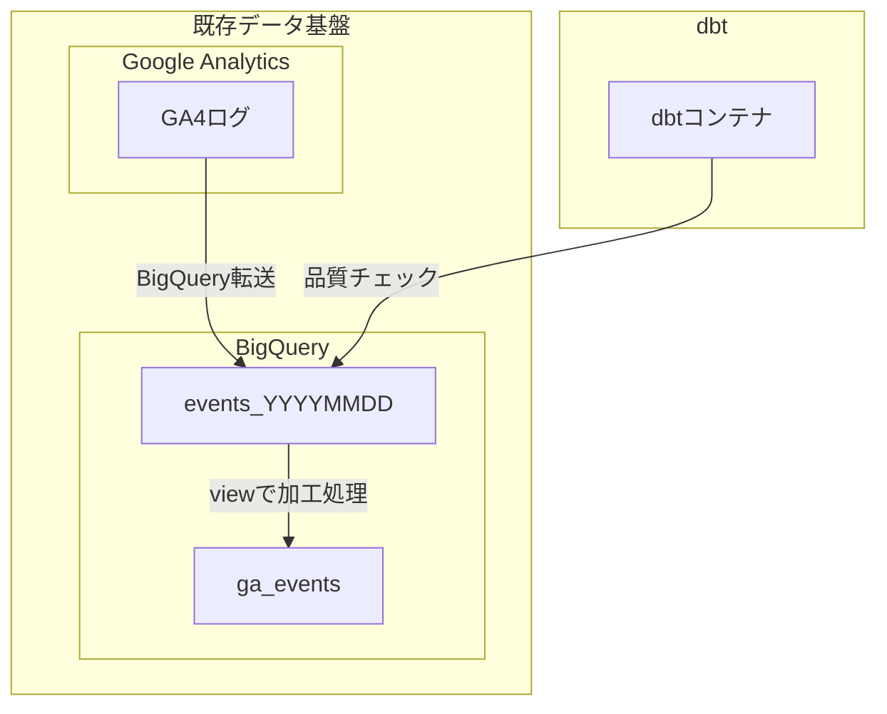

# サマリ
dbt のテスト機能とメタデータ管理機能だけならば、既存データ基盤に手を加えることなく、導入することができます。
*dbt cloud ではなく、OSS 版の dbt を利用します。

本記事では、データ基盤の運用課題に有効な手段の一つである dbt を紹介しつつ、実際にBigQuery 上のデータ基盤に導入する方法についても紹介します。

# データ基盤の運用課題と対応指針
データ基盤を運用している方は、一度は以下のような課題に悩んだことがあると思います。

- データに重複や欠損を含んでいるのに気が付かず、集計してしまった。
- 不要なテーブルを削除したら、テーブルを参照していたレポートが使えなくなり、クレームが来た。
- データマートの集計処理がしばらく失敗していたが、それに気が付けず、ユーザーからのクレームで発覚した。
- テーブルやカラムの説明が無いため、使って良いデータなのかわからない
- テーブルにうっかり個人情報が含まれていたが、気が付かず公開してしまった
- リリース後のユーザー数が増えていたが、実はリリースに伴って分析用のテーブルが重複しており、数値をかさ増ししていただけだった
- どこにどんなデータがあるかが分からず、分析したくてもできない

企業のデータ活用が盛んになって久しい昨今では、上記のような課題の対応指針は整理されてきている、と考えています。
有名なものとしてDMBOKが挙げられるのですが、そこからデータ基盤の運用に関係する部分を一部ご紹介します。

|項目|具体的な打ち手|
|-|-|
|データアーキテクチャ|どんなデータが、どんな業務で使われているのかをわかるようにする。例えば、データがどこからやってきてどこで使われているのかを図示しておく。|
|データ統合と相互運用性(ETL)|決まったタイミングでデータを更新・提供する。データ連係に失敗したらアラートを出して、アクションを取れるようにする|
|データモデリングとデザイン|テーブル同士の参照や包含などの情報をメタデータとして記録する|
|データセキュリティ|セキュリティレベルを定義して、メタデータとして記録する|
|データ品質|高品質なデータを定義して、品質を常にチェック・モニタリングする|
|メタデータ管理|様々なデータのメタデータは一箇所に集める。その上で、標準的なアクセス方法を提供し、メタデータの品質と鮮度を保つ|

打ち手の手段は手動・自動を問わないのですが、現実的には自動化ツールを使って効率的に進めた方が良いものもあります。
例えば、データの品質チェックは、毎日テーブルが更新されるたびに目検でチェックするのは不可能なので、何らかのシステムが必要になりそうです。
このシステムとして代表的なのが dbt です。
# dbt を使ったデータ基盤の運用
dbt は非常に高機能で、DMBOKで挙げられた対策のほとんどを実現できます。
下表にDMBOKの項目に対応する機能を記載します。

|dbt の提供する機能例|SQL書き換え有無|
|-|-|
| **データアーキテクチャ:** データパイプライン図を自動生成してくれます。|要|
| **データ統合と相互運用性(ETL):** dbt独自の言語でETLを定義すると、指定したワークフローで実行してくれます。ワークフローに失敗した場合は slack 等への通知が可能です。|要|
| **データモデリングとデザイン:** テーブル、カラムに対して、リレーションや制約を定義し、定義した内容を満たしているかチェックできます。|不要|
| **データセキュリティ:** メタデータにPIIのような独自タグを定義できます。|不要|
| **データ品質:** ユニーク制約や not null など、事前に定義したルールを満たしているか、実テーブルに対してチェックを実行できます。ルールは dbt が多数のマクロを用意している上、ユーザーで定義することもできます。|不要|
| **メタデータ管理:** クエリ、テスト、スキーマ定義、実テーブルなどから自動でメタデータ情報を生成します。生成したメタデータ情報は静的サイトとして公開することができ、ブラウザからアクセスして閲覧できます|不要|

さて、`SQL書き換え有無` の列について解説します。
dbt の機能の全てを引き出そうとすると、yml と sql を組み合わせた拡張SQLでクエリを書く必要があります。以下に例を示します、

*拡張SQLの例*
```sql
{{
    config(
        materialized='incremental'
    )
}}

select
    *,
    my_slow_function(my_column)

from raw_app_data.events



  -- this filter will only be applied on an incremental run
  where event_time > (select max(event_time) from {{ this }})


```

つまり、既存のデータ基盤において、クエリパイプラインを JP1 や Airflow で運用している場合は、クエリを描き直す必要が生じます。
この移行難易度の高さが理由で dbt の利用を諦めているチームは多いと思います。
これはあくまで dbt の全部の機能を利用する場合の制約で、実はクエリを書き換えなくても、上表の4/6項目に相当する機能を利用することができます。

# 既存のデータ基盤に dbt による品質チェックとメタデータ管理を導入する
例として、品質チェックとメタデータ管理の機能を、BigQuery で作成された既存の基盤に導入します。

前提となる基盤のイメージを記載します。(本記事のアクセス数を集計している GA4 のデータマートが元になっています)



イメージは以下だよ。
データのETLを実施する処理はdbtを使わず、最終的に作成されたテーブルに対して、dbt のテスト機能とメタデータ記録・生成機能を使うよ。

*イメージの図*
# 導入方法例

## dbt を実行できる環境を立てる

ここではローカルでdbtの docker イメージを pull して、dbt から BigQuery に接続するよ。

まずはここを見るよ
https://github.com/rocketechgroup/dbt-container-for-bigquery

サービスアカウントを作って、BigQuery への権限を付与するよ

`dbt-user@<your gcp project id>.iam.gserviceaccount.com` という名前でサービスアカウントを作成してください

このサービス アカウントにプロジェクトへのアクセスを許可する、の項目で、上記のアカウントに、以下の権限を付与してください。
`roles/bigquery.dataEditor`
`roles/bigquery.jobUser`

ユーザーにこのサービス アカウントへのアクセスを許可 の項目で、 dbt-user のアカウントに、以下の権限を付与してください。
`roles/iam.serviceAccountUser`
`roles/iam.serviceAccountTokenCreator`

ローカル環境にgcloud sdk をインストールし、認証してください。

```
gcloud config set project <プロジェクトID>
gcloud auth application-default login
```

クローンするよ

```
git clone https://github.com/rocketechgroup/dbt-container-for-bigquery.git
```

必要な環境変数を定義するよ

```
export PROJECT_ID=ganalytics-1312
export LOCATION=asia-northeast1
export DEFAULT_DATASET=analytics_272722196
export GOOGLE_APPLICATION_CREDENTIALS=analytics_272722196
```

docker-compose を使ってコンテナを立ち上げるよ

```
docker-compose up --build dbt-dev
```

コンテナから dbt コマンドを実行してみるよ
```
docker-compose run --rm dbt-dev /bin/bash -c "pipenv run dbt --verison"
```

お試しでテストを実行してみるよ
```
docker-compose run --rm dbt-dev /bin/bash -c "pipenv run dbt test"
```

テストが実行されれば成功だよ。デフォルトのテストは失敗するよ。

## 既存のBQテーブルに対してテストを行う

モデルを偽造するよ

モデルファイルを作るよ。/models/example/ 配下にある sql を削除して、代わりに、データセットの中に存在するテーブルの名前で、/models/の直下に sql ファイルを作るよ。
このとき、sql の中身は空にするよ。

テストを書くよ

テストのファイルは、/models/example/ 配下にある schema.yml に書いていくよ。サンプルで記載しているけど、例えばこんな感じで記載するよ。

```

version: 2

models:
    - name: ga_events
      description: "Google Analytics のデータを解析しやすいように加工した view"
      columns:
          - name: user_pseudo_id
            description: "ユーザ毎に一位のID"
            tests:
                - not_null

    - name: events_*
      description: "Google Analytics のローデータ"
      columns:
          - name: event_date
            description: "イベントが発生した日付"
            tests:
                - not_null
```

テストを書くときはここが参考になるよ
https://docs.getdbt.com/reference/resource-properties/tests

マクロも色々あるよ。ここが参考だよ。
https://github.com/dbt-labs/dbt-utils

テストを実行するよ

```
$ docker-compose run --rm dbt-dev /bin/bash -c "pipenv run dbt test"
Running with dbt=0.19.1
[WARNING]: Configuration paths exist in your dbt_project.yml file which do not apply to any resources.
There are 1 unused configuration paths:
- models.my_new_project.example

Found 4 models, 2 tests, 0 snapshots, 0 analyses, 156 macros, 0 operations, 0 seed files, 0 sources, 0 exposures

03:10:20 | Concurrency: 1 threads (target='dev')
03:10:20 | 
03:10:20 | 1 of 2 START test not_null_events_*_event_date....................... [RUN]
03:10:22 | 1 of 2 PASS not_null_events_*_event_date............................. [PASS in 1.68s]
03:10:22 | 2 of 2 START test not_null_ga_events_user_pseudo_id.................. [RUN]
03:10:24 | 2 of 2 PASS not_null_ga_events_user_pseudo_id........................ [PASS in 2.37s]
03:10:24 | 
03:10:24 | Finished running 2 tests in 4.85s.

Completed successfully

Done. PASS=2 WARN=0 ERROR=0 SKIP=0 TOTAL=2
```

テストが通れば成功だよ。
## メタデータのドキュメントを生成し、メタデータ閲覧のサービスを公開する

メタデータの仕組みは、generate でメタデータを集めたjsonファイルと静的サイトを構成するHTMLファイルを出力し、ホスティングする仕組みです。

```
docker-compose run -p 8080:8080 --rm dbt-dev /bin/bash -c "pipenv run dbt docs generate && pipenv run dbt docs serve"
```

サービスが起動できたら、ブラウザで http://localhost:8080/#!/overview にアクセスして試してください。


画面左側にある `database` をクリックすると、既存のデータセットが表示され、テーブルをドリルダウンして確認できるようになっています。
テーブルを選択すると、カラム名やデータ型を確認できます。


# 部分的な導入によるメリット
dbt は現時点ではツールで、データ基盤運用のQCDを向上できるよ
とはいえ移行するのはコストもかかるしリスクも大きいよ
まずは一部の機能だけをクイックに導入して、信頼を勝ち取った後に、予算を獲得して移行に踏み切るという作戦も有効だと思うよ

# まとめ
データパイプラインに必要な要素を説明し、dbtで解決できることを示したよ。
dbtに移行するのが難しい場合に、dbtの試験とメタデータ機能だけを導入する方法を提案したよ

# 参考文献
https://zenn.dev/takimo/articles/401a8985b6b6fc

DMBOKにあるデータマネジメントの観点と、具体的な打ち手の例
|項目|具体的な打ち手|
|-|-|
|データアーキテクチャ|どんなデータが、どんな業務で使われているのかをわかるようにする。例えば、データがどこからやってきてどこで使われているのかを図示しておく|
|データストレージとオペレーション|早くて気軽な分析用途にはDWHを、しっかりと記録したい場合はRDBを使う|
|データ統合と相互運用性(ETL)|決まったタイミングでデータを更新・提供する。データ連係に失敗したらアラートを出して、アクションを取れるようにする|
|データモデリングとデザイン|テーブル同士の参照や包含などの情報をメタデータとして記録する|
|マスターデータ管理|信頼できる統一されたマスタデータを作って、組織横断で共有できるようにする|
|ドキュメントとコンテンツ管理|ドキュメントをまとめた一覧を作って、探せるようにする|
|データセキュリティ|セキュリティレベルを定義して、メタデータとして記録する|
|データ品質|高品質なデータを定義して、品質を常にチェック・モニタリングする|
|データウェアハウジングとビジネスインテリジェンス|データを統合し、蓄積した上で、誰でも理解できる形に可視化したレポートを提供する|
|メタデータ管理|様々なデータのメタデータは一箇所に集める。その上で、標準的なアクセス方法を提供し、メタデータの品質と鮮度を保つ|
|データガバナンス|上記の内容を徹底するためのルールと計画を作る|
